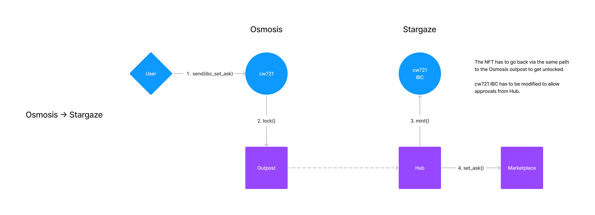

# Stargaze Marketplace Outpost

These contracts provides functionality to a CosmWasm chain to interoperate with Stargaze Marketplace. There are two contracts, Hub, and Outpost.



## Outpost

Outpost is a fork of the ICS721 bridge and adds IBC messages to communicate with Marketplace.

```rs
pub struct IbcStargazeMarketplaceSetAskMsg {
   /// IBC fields
   pub channel_id: String,
   pub timeout: IbcTimeout,
   /// Marketplace fields
   pub sale_type: SaleType,
   pub price: Coin,
   pub payment_address: String,
   pub expires_at: Timestamp,
}
```

## Hub

Hub is also a fork of the ICS721 bridge, and runs on Stargaze. It receives messages from Outposts, and communicates with Marketplace. For example, if an outpost sends a message to list an NFT, the Hub parses the message, and calls `SetAsk {}` on Marketplace.

## List an NFT on Stargaze Marketplace via Outpost

For example, to list an NFT on Marketplace:

1. Create an IBC message to list an NFT on Marketplace

```rs
pub struct IbcStargazeMarketplaceSetAskMsg {
   /// IBC fields
   pub channel_id: String,
   pub timeout: IbcTimeout,
   /// Marketplace fields
   pub sale_type: SaleType,
   pub price: Coin,
   pub expires_at: Timestamp,
}
```

2. Call `Send { contract, token_id, msg }` on a cw721 with the above message. `contract` here is an Outpost contract, and `msg` is the `IbcSetAskAwaysMsg`.

3. The Outpost contract does the IBC NFT transfer to the Hub on Stargaze.

4. The Hub on the Stargaze side receives the message, and calls `SetAsk {}` on Marketplace.

5. When an NFT is sold, the proceeds are sent to the `payment_address` specified in the IBC Set Ask message.
